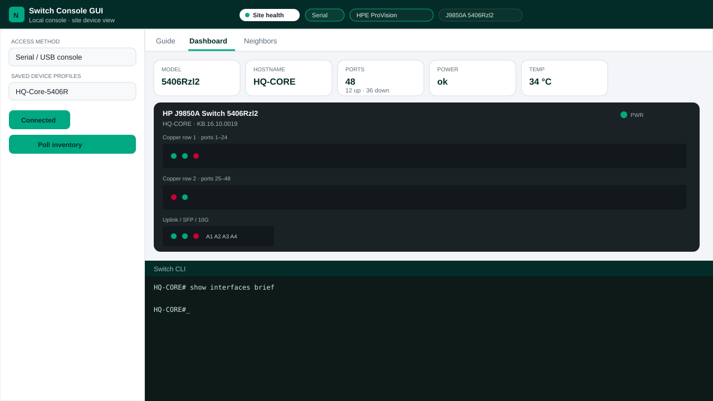
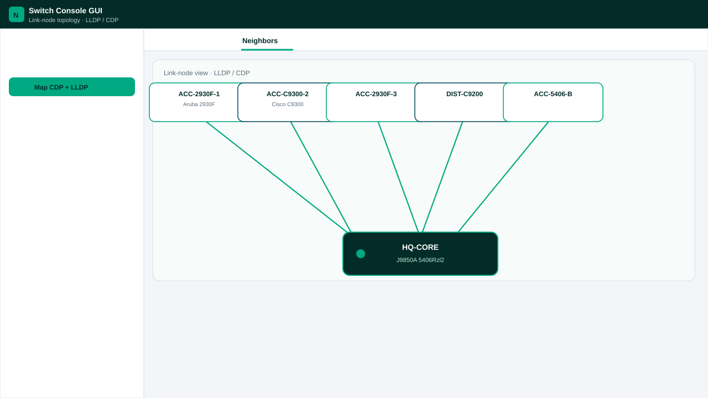
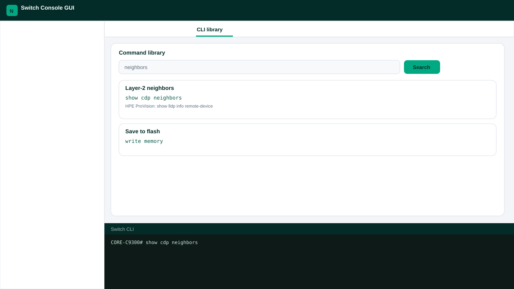

# Switch Console GUI

Field laptop tool for Cisco IOS/IOS-XE and HPE/Aruba switches (ProVision, Comware, Aruba CX).

A browser page talks to the device over:

- USB / RS-232 console (Web Serial in Chrome or Edge)
- SSH or Telnet through the local companion script

It draws a faceplate, health pills, and a CDP/LLDP link-node map, and includes a command library with Cisco and HPE equivalents.

This is a local helper. It is not HPE Aruba Central or Cisco DNA/Catalyst Center.

## Screenshots

Mocks of the field UI (48-port faceplate, neighbor map, Switch CLI).

### Dashboard



### Neighbors



### CLI library and Switch CLI



## Files

| File | Purpose |
|---|---|
| `switch-console-gui.html` | UI, parsers, topology, profiles, tutorial |
| `switch-console-server.py` | Serves the page and bridges SSH/Telnet |
| `docs/screenshots/` | Interface mocks |

`switch-console-gui.html` must be in the repo root. If it is missing after clone, copy it from your field laptop folder into this directory.

## Requirements

- Google Chrome or Microsoft Edge
- Python 3.10+
- For SSH: `pip install paramiko`
- USB-serial driver if you use a console cable (FTDI, CP210x, Prolific)

## Run

```bash
pip install paramiko
python switch-console-server.py
```

Open http://127.0.0.1:8080/switch-console-gui.html

Do not open the HTML as `file://` if you need Web Serial or SSH/Telnet.

## License

MIT
